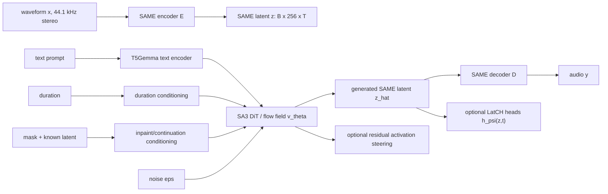

# Latent Audio Generation Research Notes

Current implementation note: this is an earlier research map. The current
repo-specific Colab mode math and implementation notes live in:

```text
docs/research/native-experimental-modes-math.md
```

Scope: open-ended research notes on Stable Audio 3, SAME, LatCH, activation steering, LoRA, inference-time guidance, and LMDM-style live diffusion. This document is not an implementation plan for a final product. It is a measurement and experiment map for discovering what current audio latent models afford.

Evidence labels used below:

- Confirmed from paper: stated in a cited technical report or paper.
- Confirmed from code/docs: observed in the official repository or audioscope repository during read-only inspection.
- Blog/repo claim: stated by the audioscope author or repository, useful but not peer-reviewed.
- Hypothesis: plausible research claim that needs measurement.
- Speculative direction: possible future work that likely needs training, architecture changes, new data, or all three.
- Unknown: not established from the sources inspected.

Historical workspace status for this note: this document was originally written before the combined SA3 Native Lab repo was assembled. It is kept for literature context. For current implementation details, use `docs/research/native-experimental-modes-math.md`.

## Primary Sources

Core references:

- Stable Audio 3 technical report: https://arxiv.org/abs/2605.17991
- SAME, Semantically-Aligned Music Autoencoder: https://arxiv.org/abs/2605.18613
- Official Stable Audio 3 repo: https://github.com/Stability-AI/stable-audio-3
- Low-Resource Guidance / LatCH: https://arxiv.org/abs/2603.04366
- Live Music Diffusion Models: https://arxiv.org/abs/2605.22717
- DITTO inference-time optimization: https://arxiv.org/abs/2401.12179
- Flow Matching: https://arxiv.org/abs/2210.02747
- Rectified Flow: https://arxiv.org/abs/2209.03003
- Classifier-Free Guidance: https://arxiv.org/abs/2207.12598
- Classifier Guidance / Diffusion Models Beat GANs: https://arxiv.org/abs/2105.05233
- Universal Guidance: https://arxiv.org/abs/2302.07121
- TFG / Unified Training-Free Guidance: https://arxiv.org/abs/2409.15761
- Controllable Music Production with Diffusion Models and Guidance Gradients: https://arxiv.org/abs/2311.00613
- Stable Audio Open: https://arxiv.org/abs/2407.14358
- MusicGen: https://arxiv.org/abs/2306.05284
- MusicLM: https://arxiv.org/abs/2301.11325
- AudioLDM: https://arxiv.org/abs/2301.12503
- AudioLDM 2: https://arxiv.org/abs/2308.05734
- MusicFlow: https://arxiv.org/abs/2410.20478
- Diff-A-Riff: https://arxiv.org/abs/2406.08384
- TANGO: https://arxiv.org/abs/2304.13731
- Make-An-Audio: https://arxiv.org/abs/2301.12661
- Mood Vectors in Audio Diffusion: https://guglielmocamporese.github.io/blog/audio-mood-steering/
- audioscope repo: https://github.com/guglielmocamporese/audioscope

## Literature Map

### Stable Audio 3 and SAME

Confirmed from paper: Stable Audio 3 is a family of latent diffusion models for variable-length audio generation and editing. It supports text-to-audio, inpainting, and continuation. The models operate over the latent space of SAME, a semantic-acoustic autoencoder for 44.1 kHz stereo audio.

Confirmed from paper and code/docs: SAME provides continuous 256-channel latent sequences with temporal downsampling ratio 4096. At 44.1 kHz, this is about:

```text
latent_rate = 44100 / 4096 = 10.7666015625 frames/sec
```

For an audio waveform with `N` samples per channel, the latent length is approximately:

```text
T ~= N / 4096
z in R^(256 x T)
```

Padding and chunking policies can change the exact boundary behavior, but 10.77 latent frames/sec is the right mental model.

Confirmed from paper: SAME uses a transformer-based autoencoder, phase-aware reconstruction losses, adversarial losses, semantic regularization, diffusion alignment, and contrastive latent alignment. SAME-S and SAME-L are released as open weights. The paper describes a 4096x temporal compression ratio.

Confirmed from code/docs: the official Stable Audio 3 repo exposes small music, small SFX, and medium models. The repo README describes:

- `small-music`: SAME-Small, CPU, 433M, max 120s.
- `small-sfx`: SAME-Small, CPU, 433M, max 120s.
- `medium`: SAME-Large, CUDA, 1.4B, max 380s.
- `large`: SAME-Large, API only, 2.7B, max 380s.

Confirmed discrepancy: the SA3 paper's DiT table reports small/medium/large diffusion transformer sizes as roughly 459M, 1.4B, and 2.7B. The repo README reports the small checkpoints as 433M. The SAME paper reports SAME-S/SAME-L autoencoder sizes separately. These numbers are close but not identical across paper/model packaging contexts, so exact parameter counts should be tied to a specific checkpoint/config rather than treated as one universal fact.

### Flow Matching and Rectified Flow

Confirmed from paper: Flow Matching trains continuous normalizing flows by regressing a vector field along a chosen probability path from data to noise or noise to data. It avoids simulation during training and can use diffusion-style or optimal-transport-style paths.

Confirmed from paper: Rectified Flow learns transport maps between distributions using straight-line interpolation and a learned velocity field. It is relevant because SA3-style "rectified flow" samplers are naturally interpreted as integrating a conditional vector field over SAME latents rather than as discrete token autoregression.

Confirmed from paper and code/docs: SA3 training is described using a flow-matching objective over SAME latents. A simplified path is:

```text
z_t = (1 - t) z_0 + t eps
target velocity = eps - z_0
v_theta(z_t, t, c) ~= eps - z_0
```

where `z_0` is a clean SAME latent, `eps` is noise, `t` is a noise/time parameter, and `c` includes conditioning such as prompt, duration, and inpainting context.

### Guidance Literature

Confirmed from paper: classifier guidance steers diffusion models by adding gradients from an external classifier or predictor. It trades diversity for fidelity/control, but it requires a suitable differentiable guide.

Confirmed from paper: classifier-free guidance trains conditional and unconditional behavior jointly, then combines conditional and unconditional predictions at inference time. In SA3, CFG is available in code and docs, but post-trained models default to low CFG scale and few steps.

Confirmed from paper: Universal Guidance and TFG generalize guidance to arbitrary differentiable objectives. These are conceptually important for audio controls because controls like loudness, pitch, loop boundary continuity, and prompt match can be written as losses. The engineering bottleneck is whether the loss can be evaluated cheaply and differentiably at the right representation level.

Confirmed from paper: the guidance-gradient music paper demonstrates differentiable control of music diffusion models using objective functions, including rhythm and other production-relevant targets. It sits in the same family as DITTO/TFG but emphasizes music-production control signals.

### Audio and Music Baselines

Confirmed from paper: MusicLM models text-conditioned music generation as a hierarchical sequence-to-sequence problem and can condition on text and melody.

Confirmed from paper: MusicGen is an autoregressive transformer language model over compressed discrete audio token streams and supports text and melody conditioning. It is a useful contrast case because it generates discrete codec tokens, while SA3 generates continuous SAME latents with flow/diffusion dynamics.

Confirmed from paper: AudioLDM and AudioLDM 2 are latent-diffusion text-to-audio systems built around learned audio representations and text/audio embeddings such as CLAP-like conditioning. They are relevant baselines for text-to-audio quality, representation choices, and CLAP-based evaluation.

Confirmed from paper: TANGO uses an instruction-tuned language model as text encoder for text-to-audio latent diffusion and shows that text-encoder choice can materially affect prompt adherence.

Confirmed from paper: Make-An-Audio uses prompt-enhanced diffusion and spectrogram autoencoding. It is useful historically for prompt enhancement and scarcity of high-quality text/audio pairs.

Confirmed from paper: MusicFlow uses cascaded flow matching over semantic and acoustic features, and uses masked prediction to enable infilling and continuation. It is an important adjacent flow-matching music model.

Confirmed from paper: Diff-A-Riff targets production workflows by generating instrumental accompaniments with text and/or audio references. It is useful as a reminder that text-only full-song generation is not the only relevant interaction mode.

### LatCH

Confirmed from paper: LatCH, in "Low-Resource Guidance for Controllable Latent Audio Diffusion", addresses the cost of guidance in latent audio diffusion. Instead of backpropagating through the decoder and audio-domain feature extractors at every step, it trains small latent-control heads that operate directly on latent representations.

Confirmed from paper: the LatCH paper reports roughly 7M additional parameters and about 4 hours of training for its control heads. Experiments are on Stable Audio Open, not Stable Audio 3/SAME. The controlled signals include intensity, pitch, beats, and combinations.

Important distinction: Stable Audio Open latents in the LatCH paper are not SAME latents. The LatCH paper describes SAO latents with different channel count and temporal rate. Applying LatCH to SA3 means retraining equivalent sidecar heads on SAME latents, not directly reusing those latent dimensions.

### DITTO

Confirmed from paper: DITTO is inference-time optimization over initial noise latents. It does not fine-tune the base generator. It differentiates through the sampling process and optimizes the initial noise for a target feature-matching loss.

Simplified formulation:

```text
z_0_hat = Sampler_theta(eps, c)
eps* = argmin_eps L(f(z_0_hat), y_target)
```

where `f` is a differentiable feature extractor or descriptor and `y_target` is the desired property.

Confirmed from paper: DITTO demonstrated inpainting, outpainting, looping, intensity, melody, and structure control. It is flexible but computationally heavier than ordinary sampling and can over-optimize a target at the expense of quality or text relevance.

### LMDM

Confirmed from paper: Live Music Diffusion Models convert offline diffusion models into interactive block-wise generators by changing how clean context and noisy target blocks are routed through attention. The key problem is that bidirectional attention makes clean context representations depend on noisy target frames at every denoising step, which prevents caching.

Confirmed from paper: LMDM separates clean context from noisy target and uses attention masking/routing to enable key/value caching across denoising steps. A block-causal variant also enables temporal caching of committed past context. ARC-Forcing post-training improves rollout stability.

Important distinction: SA3 continuation is not automatically an LMDM. Rolling continuation via inpainting/continuation is a public-interface approximation. True LMDM behavior would require attention routing, masking, cache semantics, and fine-tuning/post-training.

### Activation Steering and audioscope

Blog/repo claim: audioscope applies contrastive mean-difference vectors to Stable Audio 3 DiT residual activations. It constructs paired prompts such as happy vs sad while holding genre/instrument context relatively stable, collects residual-stream activations by transformer layer, computes a direction:

```text
v_l = mean(h_l_positive) - mean(h_l_negative)
```

and injects it during inference:

```text
h_l <- h_l + alpha * v_l
```

Blog/repo claim: the author reports that valence/mood is most linearly separable in mid-network layers, especially around layer 11, and that positive alpha tends to increase bright/euphoric/dense qualities while negative alpha tends to increase melancholic/slower/sparser qualities.

Confirmed from audioscope code: activation collection uses forward hooks to record block outputs. Steering uses direct monkey-patching of `block.forward`, not ordinary forward-hook mutation. The code comments explain that SA3 `TransformerBlock.forward` is decorated with `@compile`, and that ordinary forward hooks can fire but fail to change compiled graph computation.

Confirmed from official SA3 code: `TransformerBlock.forward` is decorated with `@compile` in the inspected repository. This makes the audioscope warning operationally relevant for replication.

Unresolved implementation detail: audioscope imports `stable_audio_tools` in some generation utilities, while the current official Stable Audio 3 repo uses the `stable_audio_3` package. A replication should verify wrapper paths and generation calls against the exact installed package and checkpoint.

## Architecture Map



### SAME

Confirmed from paper/code/docs:

- Input/output: stereo audio at 44.1 kHz.
- Latent object: continuous latent tensor with 256 channels and latent time length `T`.
- Temporal downsampling: 4096x.
- Latent rate: about 10.77 frames/sec.
- Compression topology: a 1D sequence over time, with a 256-dimensional vector at each latent frame.

Rough scalar compression:

```text
raw stereo scalar samples per latent frame = 2 * 4096 = 8192
latent scalar values per latent frame = 256
scalar ratio = 8192 / 256 = 32
```

This 32x scalar ratio is not a bitrate claim because waveform samples and floating-point latents use different numerical precision and entropy. It is still a useful geometric intuition: SAME drastically shortens time while keeping a high-dimensional continuous vector per frame.

### Stable Audio 3 DiT

Confirmed from paper:

- SA3 projects 256-dimensional SAME latents into a transformer width.
- It prepends learned memory embeddings.
- It uses transformer blocks to predict a denoising/flow field over latent sequences.
- It conditions on text, duration, timestep, and inpainting context.
- It discards memory embeddings before projecting back to the 256-channel latent field.

Confirmed from paper:

- Small model: width 1024, depth 20, 16 heads, SAME-S.
- Medium model: width 1536, depth 24, 24 heads, SAME-L.
- Large model: width 2048, depth 26, 32 heads, SAME-L.
- Medium/large use differential attention in the paper description.

Confirmed from code/docs:

- Inference defaults for post-trained models are around 8 steps and CFG scale 1.
- Base checkpoints use more conventional settings such as more steps and stronger CFG.
- Audio-to-audio uses `init_audio` and `init_noise_level`.
- Inpainting and continuation are exposed by passing reference audio and mask start/end times.
- `return_latents=True` can return SAME latents rather than decoded audio.
- LoRA can be applied to diffusion backbone and conditioner modules, with runtime strength and interval controls.

### Conditioning Paths

Confirmed from paper/code/docs:

- Text: encoded by T5Gemma in the public implementation.
- Duration: represented by a numeric conditioner and injected into the model.
- Timestep/noise: injected through adaptive normalization/global conditioning.
- Inpainting/continuation: known reference audio is encoded to SAME latents, multiplied by a binary mask, concatenated or projected with the mask, and added as local conditioning in transformer blocks.
- Negative prompt/CFG: available in base-model inference and code paths, but post-trained models default to lower CFG usage.
- LoRA: weight adaptation paths can modify both the DiT and trainable conditioner components.

Unknown:

- Exact gated checkpoint config values may differ from public source defaults.
- The exact effective prompt length and tokenizer settings should be checked against the model card/config for each checkpoint. The paper describes text sequences of 256 embeddings; source defaults in some utilities may be shorter.

### Inpainting and Continuation as Composition Operators

Research framing:

```text
z_known = E(x_reference)
m[t] = 1 for preserved latent frames
m[t] = 0 for generated latent frames
SA3 samples z_missing ~ p_theta(z_missing | m * z_known, m, prompt, duration)
```

Continuation is a special case where `m=1` for the prefix and `m=0` for future frames. Inpainting is the general case where missing spans may be internal or multiple non-contiguous regions.

This makes SA3 useful not only as a "song generator" but as a latent composition operator:

- extend a phrase,
- replace a section,
- bridge between known boundaries,
- create variations from a partial reference,
- branch multiple futures from the same context,
- score/rank futures using descriptors or human preference.

## Mathematical Formulation

### SAME Autoencoding

Let `x in R^(2 x N)` be stereo waveform samples at 44.1 kHz.

```text
E: R^(2 x N) -> R^(256 x T)
D: R^(256 x T) -> R^(2 x N)
T ~= N / 4096
z = E(x)
x_hat = D(z)
```

Research question: what topology does SAME impose on audio? The obvious topology is temporal sequence plus channel vector, but the semantic topology is learned: neighboring latent vectors may reflect timbre, harmony, loudness, rhythm, section role, or other factors. SAME's semantic regularizers make it plausible that some audio descriptors are linearly or smoothly recoverable from `z`, but this has to be measured control by control.

### SA3 Conditional Latent Generation

Let `c` include text, duration, timestep/noise information, and optional inpainting context.

```text
p_theta(z | c)
```

or for inpainting:

```text
p_theta(z_missing | z_known, m, prompt, duration)
```

The flow-matching training view:

```text
z_t = (1 - t) z_0 + t eps
v_target = eps - z_0
min_theta E[ || v_theta(z_t, t, c) - v_target ||^2 ]
```

Sampling integrates a learned conditional vector field over SAME latent space. In a rectified-flow view, the learned object is not a token distribution or an audio waveform distribution directly. It is a vector field over noisy continuous latent sequences conditioned on prompt and context.

### LatCH Sidecar

For a control vector `y`, a LatCH-style head can be written:

```text
h_psi(z_0) -> y
h_psi(z_t, t) -> y
h_psi(z_t, t, prompt) -> y_or_prompt_match
```

Uses:

- observability: estimate control values from generated latents,
- predictability: test whether SAME latents encode a control,
- ranking: choose among sampled branches,
- direct guidance: backpropagate a latent-space loss through `h_psi`.

The minimum viable use is not guidance. The minimum viable use is measurement and branch ranking.

### Activation Steering

For transformer layer `l`, prompt pairs define positive and negative activation samples:

```text
v_l = normalize(mean_i h_l(prompt_i_positive) - mean_i h_l(prompt_i_negative))
h_l <- h_l + alpha * v_l
```

Key difference from LatCH: activation steering edits the internal computation of SA3 at inference time. It does not train a separate predictor and does not use an explicit audio descriptor loss during sampling. Its validity depends on whether the contrastive direction causally controls output attributes rather than merely correlating with them.

### DITTO / Inference-Time Optimization

```text
eps* = argmin_eps L(f(Sampler_theta(eps, c)), y_target)
```

where `eps` is the initial noise or latent seed. In SA3/SAME terms, DITTO would optimize the initial SAME-latent noise under a differentiable sampler and descriptor stack. This is more invasive and expensive than branch-and-rank, but it can target continuous controls without changing model weights.

## What Is the Latent Object?

Confirmed facts:

- SAME latent: continuous sequence, shape approximately `B x 256 x T`.
- Rate: about 10.77 frames/sec at 44.1 kHz.
- Decoder maps the latent sequence back to stereo waveform.
- SA3 learns a conditional denoising/vector field over these latents.

Likely encoded, but needs measurement:

- broad loudness envelope,
- spectral brightness and noisiness,
- stereo image,
- beat/grid information at coarse time scale,
- section-level structure,
- text-prompt semantic correlates,
- timbre/style clusters,
- mood/valence correlates.

Likely difficult:

- sub-frame transients below the 93 ms latent-frame interval,
- exact phase and microtiming as direct linear controls,
- precise note-level edits without decoder/sampler dynamics,
- disentangled controls without sidecar models or interventions.

Unknown:

- Whether SAME latent axes have interpretable channel-level semantics.
- Whether mood/tension/style are linearly separable in SAME latents or only in SA3 internal activations.
- Whether specific controls are more accessible in `z_0`, noisy `z_t`, intermediate denoised estimates, or DiT residual streams.

## Statistical Map of Controls

The core framework should separate three properties:

```text
observability: can the control be measured robustly?
predictability: can it be predicted from SAME latents?
intervenability: can generation be steered so the control changes?
```

A control is research-ready only when all three are measured separately. A descriptor can be observable without being controllable. A latent probe can predict a property without providing a causal steering direction. A prompt can affect a property without making it reliable or independent of other properties.

### Control Table

| Control | Automatic descriptors | Manual labels | Prompt templates | Latent proxies to test | Likely intervention tier |
|---|---|---|---|---|---|
| Loudness / intensity | RMS, LUFS, peak, dynamic range, envelope slope | weak/strong, too quiet, too compressed | quiet/loud, intimate/powerful, soft/aggressive | latent norm, channel energy, low-rank envelope components | prompt, branch-rank, LatCH, DITTO, direct guidance |
| Brightness | spectral centroid, rolloff, high/low energy ratio | bright/dark, muffled/crisp | bright shimmering, dark warm, muted | latent PCA/correlations with spectral descriptors | prompt, branch-rank, LatCH, activation steering |
| Density / activity | onset rate, spectral flux, event count, polyphony proxy | sparse/dense, busy/minimal | sparse arrangement, dense wall, active percussion | temporal latent variance, flux in latent trajectory | prompt, branch-rank, LatCH, activation steering |
| Noisiness / grain | spectral flatness, harmonic/noise ratio, roughness | clean/grainy/noisy | clean tone, noisy texture, tape grain | latent high-frequency temporal variation, decoder residual sensitivity | prompt, LatCH, LoRA for texture domains |
| Stereo width | mid/side energy, inter-channel correlation, ILD | narrow/wide/immersive | mono centered, wide stereo, spacious | SAME may encode ILD because semantic regression included ILD-like terms | prompt, LatCH, direct guidance |
| Energy slope | RMS envelope over time, build/drop curves | builds/fades, static/dynamic | gradual build, sudden drop, fade out | latent envelope trend, first temporal principal components | prompt, branch-rank, LatCH, DITTO |
| Beat strength | beat tracker confidence, onset periodicity | weak/strong groove | strong four-on-floor, no beat, pulsing | periodic latent components around beat grid | prompt, LatCH, branch-rank |
| Pitch/register | CREPE, BasicPitch, chroma, F0 histograms | low/high, bass/mid/topline | low bass drone, high melody, midrange pad | latent-channel correlation with pitch/chroma | prompt, LatCH difficult for rapid pitch, DITTO |
| Harmony/key | chroma, key estimator, tonal centroid | key match, harmonic stability | in C minor, modal, dissonant | latent clusters by chroma/key | prompt, branch-rank, prompt-aware LatCH |
| Section role | novelty curve, structural segmentation | intro, build, drop, outro, transition | intro, build-up, drop, breakdown | long-range latent trajectory shape | prompt, human labels, LatCH, LoRA if domain-specific |
| Tension | dissonance, roughness, spectral flux, density, harmonic instability | tense/relaxed, suspenseful/resolved | tense build, relaxed resolution | multi-descriptor latent direction, activation probes | prompt, activation steering, human-labeled LatCH |
| Valence / mood | CLAP anchor scores, music emotion classifiers | happy/sad, euphoric/melancholic | happy/sad paired prompts by genre | SA3 residual vectors, SAME latent probes | prompt, activation steering, branch-rank, LatCH |
| Prompt adherence | CLAP/text-audio similarity, captioning consistency | prompt match score | explicit controlled prompt sets | prompt-aware latent/text model score | branch-rank, CFG, prompt-aware LatCH, DITTO |
| Style match | embedding similarity to references, classifier score | style match preference | style tags, era/genre/instrument descriptors | latent embedding clusters | prompt, LoRA, branch-rank |
| Transition quality | boundary RMS/spectral discontinuity, beat continuity, embedding continuity | smooth/jarring transition | bridge, seamless transition | latent boundary derivative, context mismatch | inpainting, branch-rank, DITTO |
| Loop usability | boundary similarity, click detection, beat/bar alignment | usable loop yes/no | seamless loop, looping phrase | first/last latent similarity, periodicity | branch-rank, DITTO, inpainting |

### Building the Map

Dataset unit:

```text
audio.wav
prompt.txt
controls.json
latents.npy
metrics.json
```

Example `controls.json`:

```json
{
  "brightness": 0.8,
  "density": 0.3,
  "tension": 0.7,
  "section_role_build": 1.0,
  "prompt_match": 0.9,
  "usable_loop": 1.0
}
```

Recommended stages:

1. Encode a corpus with SAME and compute reconstruction metrics.
2. Compute automatic descriptors from audio.
3. Compute descriptor summaries aligned to SAME latent frames where possible.
4. Train simple probes from pooled and framewise SAME latents to descriptors.
5. Test held-out generalization across genre, duration, and prompt style.
6. Add manual labels for subjective controls that descriptors cannot capture.
7. Compare audio-only, prompt-aware, and pairwise-preference heads.
8. Use heads first for measurement/ranking before using them for guidance.

## Guidance and Steering Taxonomy

| Method | Training required | Internal model access | Main use | Strengths | Failure modes |
|---|---:|---:|---|---|---|
| Prompt augmentation | No | No | semantic nudging | safe, public API, cheap | weak, entangled, hard to quantify |
| Weighted references / audio-to-audio | No | No | style/content reference steering | uses existing editing paths | may preserve unwanted source features |
| Branch-and-rank | No, unless trained scorer | No | candidate selection | robust baseline, easy to measure | compute scales with candidates; no true steering |
| LatCH | Small sidecar | Latent access | descriptor prediction, ranking, possible guidance | cheap compared with decoder guidance | needs labels/descriptors; may miss subjective controls |
| Activation steering | No weight training | Yes, DiT internals | residual control knobs | can reveal internal representation geometry | hook/compile fragility; causal validity unknown |
| DITTO | No model training | Differentiable sampler | arbitrary differentiable objectives | flexible and training-free for base model | slow, memory-heavy, can over-optimize |
| Direct sampler guidance | Usually a guide/predictor | Sampler modification | gradient steering | stronger than ranking | off-manifold risk, descriptor gaming |
| LoRA | Adapter training | Weight adaptation | style/domain transfer | compact, stackable, strong style adaptation | entangles controls; not ideal for one-off scalar knobs |
| Architecture/routing changes | Fine-tuning/full training | Full model | new native conditioning | clean if trained well | highest cost and blast radius |
| LMDM-style streaming | Fine-tuning/post-training | Attention/routing/cache changes | live block-wise generation | low-latency interactive generation | not available from SA3 as-is |

### How the Methods Differ

Prompt augmentation changes `c`, the public text condition. It is weak but should always be a baseline.

Branch-and-rank changes selection, not generation. It estimates:

```text
argmax_i score(generate(seed_i, c))
```

LatCH adds a learned measurement/control head in latent space:

```text
score_i = h_psi(z_i)
```

Activation steering modifies internal activations:

```text
h_l <- h_l + alpha * v_l
```

LoRA modifies model weights through a low-rank adapter:

```text
W_eff = W + Delta_W_lora
```

DITTO modifies the initial noise or latent seed:

```text
eps <- eps - eta * grad_eps L
```

Direct guidance modifies the denoising/flow trajectory:

```text
v_guided = v_theta + guidance_term
```

LMDM modifies generation topology and runtime semantics:

```text
generate block k conditioned on cached committed context blocks
```

## Prompt-Only and Branch-and-Rank Baselines

Prompt-only experiments should not be dismissed. They provide the lower bound and expose how much control already exists in public conditioning.

Suggested prompt axes:

- happy/sad,
- bright/dark,
- sparse/dense,
- calm/intense,
- tense/relaxed,
- clean/grainy,
- narrow/wide stereo,
- build/drop,
- intro/drop/outro,
- loopable/non-loopable.

For each axis:

1. Define paired prompts that differ only in the target phrase.
2. Generate multiple seeds per pair.
3. Measure automatic descriptors and CLAP-like embedding scores.
4. Use human listening notes for failures and ambiguous cases.
5. Report effect size and variance, not just cherry-picked examples.

Branch-and-rank baseline:

```text
for seed in seeds:
    z_seed = generate(prompt, seed)
    score_seed = descriptor_or_LatCH(z_seed)
select top-k for listening
```

This is the best first baseline for subjective controls because it does not require modifying SA3 internals and it produces immediate variance estimates.

## LatCH Research Plan for SAME

LatCH should be treated as a sidecar measurement and control layer, not as a built-in SA3 component.

### Minimal LatCH-SAME Version

Inputs:

```text
z: SAME latent, B x 256 x T
optional t: diffusion/flow time if training on noisy/intermediate latents
optional prompt embedding: for prompt-aware scores
```

Outputs:

```text
framewise controls: loudness envelope, pitch bins, beat probability
clipwise controls: brightness, density, stereo width, tension, style match
pairwise controls: candidate B better than A for prompt/control
```

Training sources:

- automatic descriptors extracted from audio,
- labels from controlled prompt templates,
- human ratings,
- pairwise preferences,
- synthetic targets for simple envelopes or loop conditions.

Priority controls for first LatCH-SAME:

1. Loudness/intensity envelope.
2. Brightness.
3. Density/activity.
4. Stereo width.
5. Beat strength.
6. Valence/tension only after manual labels or robust embedding anchors exist.

Reasoning: these controls are either low-frequency, descriptor-measurable, or likely represented in SAME because they affect reconstruction and broad semantics. Fine pitch and exact harmony are valuable but more fragile.

### Audio-Only vs Prompt-Aware Heads

Audio-only:

```text
h_psi(z) -> y
```

Good for objective controls such as loudness, brightness, beat strength, stereo width.

Prompt-aware:

```text
h_psi(z, prompt) -> prompt_match_or_control
```

Good for prompt adherence, style match, and contextual controls like "the transition fits this prompt".

Pairwise preference:

```text
h_psi(z_a, z_b, prompt, target) -> P(better_b)
```

Good for subjective controls like usable loop, transition quality, tension, section role, and prompt adherence.

## Activation Steering Replication Plan

Treat audioscope as a promising experimental artifact, not ground truth.

### Confirmed Implementation Notes

Confirmed from audioscope:

- Uses contrastive prompt pairs across genres.
- Collects residual-stream block outputs with forward hooks.
- Computes per-layer mean-difference vectors.
- Probes layers with logistic regression.
- Applies steering by monkey-patching `block.forward`.
- Evaluates alpha sweeps with CLAP-like valence anchors and genre-consistency metrics.

Confirmed from official SA3 code:

- Transformer block forward methods are compiled in the inspected repo, so hook-side mutation needs explicit verification.

Potential mismatch:

- audioscope generation helpers reference `stable_audio_tools`; the current official SA3 package is `stable_audio_3`. Replication should update or verify wrapper access paths.

### Replication Protocol

1. Pin exact SA3 package version, checkpoint, commit hash, torch version, CUDA/CPU backend, and compile settings.
2. Identify DiT layer path programmatically and assert the number of blocks.
3. Build paired prompt sets:
   - happy/sad,
   - bright/dark,
   - sparse/dense,
   - calm/intense,
   - tense/relaxed,
   - clean/grainy.
4. Hold genre/instrument constant inside each pair.
5. Use fixed seeds and fixed durations.
6. Record activations by layer, timestep, seed, prompt, and pair label.
7. Compute:
   - mean-difference vector per layer,
   - unit-normalized and unnormalized variants,
   - train/test linear probes,
   - held-out genre performance,
   - prompt-family held-out performance.
8. Before listening tests, validate that activation patching actually changes tensors:
   - compare hidden states with/without patch,
   - compare final latent deltas with alpha signs,
   - test a deliberately large alpha on a short generation.
9. Sweep alpha:
   - e.g. `[-20, -10, -5, -3, 0, 3, 5, 10, 20]`,
   - preserve same prompt and seed.
10. Measure outputs:
   - audio descriptors,
   - SAME latent descriptors,
   - CLAP/audio-text scores,
   - emotion/valence embeddings,
   - human listening notes.
11. Report:
   - stable controls,
   - genre-bound controls,
   - seed sensitivity,
   - quality degradation thresholds,
   - failure modes such as endings, silence, prompt drift, tempo collapse, or density artifacts.

### Key Validity Questions

- Does the vector causally change mood or just correlated factors such as tempo, density, brightness, or instrumentation?
- Is layer 11 special for all checkpoints, only medium, or only the tested setup?
- Are directions robust across prompts not used to compute them?
- Do directions transfer across duration and generation mode?
- Are alpha effects monotonic?
- Can multiple steering vectors be composed without destructive interference?
- Is the same control visible in SAME latents, or only in SA3 residual stream?

## SAME Latent-Space Experiment Plan

### Notebook 1: Encode/Decode Audit

Goal: verify the latent object and reconstruction behavior.

Steps:

1. Load SAME-S and/or SAME-L.
2. Encode short clips of different genres, SFX, silence, transients, and stereo scenes.
3. Record latent shape, duration, sample rate, padding, dtype, and memory.
4. Decode and measure reconstruction:
   - multi-resolution spectral error,
   - LUFS/RMS difference,
   - stereo correlation difference,
   - onset preservation,
   - perceptual listening notes.
5. Save:
   - waveform,
   - reconstructed waveform,
   - latent tensor metadata,
   - metrics.

### Notebook 2: Latent Statistics

Goal: map distributional geometry.

Metrics:

- per-channel mean/std/skew/kurtosis,
- covariance/correlation matrix,
- PCA/ICA over pooled frames,
- temporal autocorrelation,
- latent velocity `z[t+1] - z[t]`,
- latent curvature,
- norm/envelope correlation,
- silence and onset latent signatures,
- genre/style clustering.

Questions:

- Are channels standardized by SAME soft-normalization?
- Are a small number of latent directions correlated with global loudness or brightness?
- Do section boundaries create large latent velocity spikes?
- Does stereo width appear in specific directions?

### Notebook 3: Descriptor Predictability

Goal: test what controls are predictable from SAME latents.

Models:

- linear regression/classification on pooled latents,
- temporal convolution over framewise latents,
- small transformer head,
- prompt-aware head with frozen prompt embeddings.

Targets:

- intensity envelope,
- brightness,
- density,
- beat strength,
- pitch/register,
- stereo width,
- loop boundary quality,
- prompt match.

Report:

- in-domain and held-out-genre performance,
- framewise vs clipwise performance,
- audio descriptor reliability,
- calibration curves.

### Notebook 4: Latent Perturbations

Goal: test local geometry and decoder semantics without changing SA3.

Perturbations:

- channel-wise scaling,
- PCA direction walks,
- descriptor-correlated direction walks,
- temporal smoothing,
- temporal interpolation,
- segment replacement,
- latent noise injection,
- boundary crossfades in latent space.

Evaluation:

- audio descriptors before/after,
- reconstruction quality,
- artifacts,
- perceptual notes,
- whether changes are monotonic and localized.

Warning: decoder-only latent perturbations are not equivalent to SA3 generation steering. They reveal SAME geometry, not necessarily SA3 controllability.

### Notebook 5: Branch-and-Rank Map

Goal: establish controllability baseline without internal hooks.

Protocol:

1. Choose prompt/control pairs.
2. Generate `n` candidates per prompt.
3. Score by automatic descriptors and human labels.
4. Select top and bottom candidates.
5. Estimate controllable variance:

```text
effect_size = mean(score_top_k) - mean(score_random)
```

6. Compare prompt-only vs branch-and-rank vs prompt+branch.

## Manual Label and Prompt-Template Harness

### Dataset Shape

```text
example_id/
  audio.wav
  prompt.txt
  controls.json
  notes.md
```

Example `controls.json`:

```json
{
  "brightness": 0.8,
  "density": 0.3,
  "tension": 0.7,
  "valence": -0.4,
  "section_role_intro": 0.0,
  "section_role_build": 1.0,
  "section_role_drop": 0.0,
  "prompt_match": 0.9,
  "style_match": 0.7,
  "transition_quality": 0.6,
  "usable_loop": 1.0
}
```

### Prompt Template Principles

- Keep genre/instrument fixed inside a contrastive pair.
- Change one target descriptor phrase at a time.
- Include neutral prompts as anchors.
- Include held-out genre families.
- Include short and long durations.
- Save every prompt, seed, sampler setting, checkpoint, and output.

Example pairs:

```text
"a sparse ambient piano piece, soft and minimal"
"a dense ambient piano piece, layered and active"

"a bright clean synth arpeggio with shimmering highs"
"a dark muted synth arpeggio with warm low tones"

"a relaxed cinematic string bed with gentle motion"
"a tense cinematic string bed with suspenseful motion"
```

### Human Labeling

Useful subjective labels:

- tension,
- valence,
- section role,
- prompt adherence,
- style match,
- transition quality,
- loop usability,
- musical coherence,
- novelty without prompt drift.

Use both scalar labels and pairwise preferences. Pairwise labels are often more reliable:

```json
{
  "prompt": "a tense cinematic build",
  "target": "tension",
  "candidate_a": "seed_014.wav",
  "candidate_b": "seed_029.wav",
  "preferred": "b",
  "confidence": 0.8
}
```

### Descriptor Caution

Automatic descriptors are useful, but none is a direct substitute for human listening:

- CLAP valence can conflate prompt semantics, genre, instrumentation, and production style.
- Beat trackers fail on ambient/noisy material.
- Pitch trackers fail on polyphony and percussive sources.
- Loudness and density are often entangled.
- Tension is not a single acoustic variable.

The harness should record descriptor values and human notes side by side.

## LoRA Research Position

LoRA should not be the default answer for every control. It is most appropriate when the target is style/domain adaptation:

- artist-like production domain,
- instrument family,
- recording aesthetic,
- genre/subgenre,
- SFX class,
- dataset-specific sound palette,
- consistent arrangement idiom.

Confirmed from official docs/code:

- LoRA training freezes base weights and optimizes adapter parameters.
- LoRA can be applied to linear and Conv1d layers.
- Official docs describe stackable LoRAs, runtime strength control, conditioner/backbone strength, sigma/noise interval control, and layer filtering.

Research uses:

- Train a small LoRA for a style domain, then map which descriptors changed.
- Test whether LoRA shifts SAME latent distributions predictably.
- Compare LoRA style adaptation against prompt-only and branch-and-rank.
- Combine LoRA with LatCH measurement to quantify collateral changes.

Risks:

- A LoRA may entangle style with tempo, loudness, instrumentation, and arrangement.
- LoRA is not ideal for an interpretable scalar knob unless trained with explicit control structure.
- Small datasets can overfit or memorize.
- Combining multiple LoRAs can produce nonlinear interactions.

## Direct Sampler Guidance Requirements

Direct guidance needs:

- access to the sampler loop,
- differentiable estimate of clean latent/audio at each step,
- a loss function for the target control,
- stable scaling schedule over noise/time,
- safeguards against off-manifold drift.

For SA3/SAME, possible guide functions:

- LatCH head over `z_t` or predicted `z_0`,
- differentiable SAME decoder plus audio descriptor,
- CLAP/audio embedding loss if differentiable and stable,
- loop-boundary latent loss,
- prompt-aware score model.

Unknowns:

- best noise-time interval for audio controls,
- whether guidance should apply to velocity, denoised estimate, or latent state,
- whether guidance should be projected orthogonal to CFG direction,
- how to preserve prompt adherence and audio quality under strong control losses.

Minimum safe approach:

1. Establish branch-and-rank baseline.
2. Train/evaluate LatCH as a predictor only.
3. Use LatCH for ranking.
4. Only then test gradient guidance on a small set of objective controls.

## LMDM Conceptual Adaptation to SA3/SAME

### Public-Interface Approximation: Rolling Continuation

This does not make SA3 an LMDM, but it can approximate a live workflow:

1. Maintain committed audio context.
2. Call SA3 continuation for the next block.
3. Generate multiple candidate next blocks.
4. Score candidates with descriptors, LatCH, CLAP, or human input.
5. Commit one block.
6. Crossfade/overlap if needed.
7. Repeat with a sliding context window.

At SAME rate:

```text
1 sec ~= 11 latent frames
5 sec ~= 54 latent frames
10 sec ~= 108 latent frames
```

Research metrics:

- latency per candidate,
- transition discontinuity,
- prompt drift,
- harmonic/rhythmic drift,
- loop/section stability,
- diversity among candidate futures,
- cumulative degradation after many blocks.

### True LMDM-Style SA3

Speculative direction requiring architecture/fine-tuning:

- split clean context and noisy target streams,
- add attention masks so context encodings do not depend on target noise,
- cache clean-context K/V across denoising steps,
- optionally make context block-causal for temporal cache reuse,
- fine-tune for block-wise continuation,
- apply ARC-style post-training for long-rollout stability,
- design policy for committed vs editable context.

Open question: whether SA3's variable-length and inpainting training provides enough prior for rolling continuation to be musically useful without LMDM-style retraining. This should be measured before architecture changes.

## Training vs Inference-Time Intervention Matrix

| Intervention | No training | Sidecar training | LoRA training | Full fine-tune / architecture | Notes |
|---|---:|---:|---:|---:|---|
| Prompt augmentation | Yes | No | No | No | public baseline |
| Negative prompt / CFG | Yes | No | No | No | stronger for base checkpoints |
| Audio-to-audio / continuation | Yes | No | No | No | existing SA3 mode |
| Branch-and-rank by descriptors | Yes | No | No | No | compute-heavy but robust |
| Branch-and-rank by LatCH | No | Yes | No | No | good first use of LatCH |
| LatCH direct guidance | No | Yes | No | No | sampler modification needed |
| Activation steering | Yes | No | No | No | internal hooks/patching needed |
| DITTO | Yes | No | No | No | differentiable sampler/descriptor needed |
| LoRA style adaptation | No | No | Yes | No | style/domain transfer |
| Native new conditioning tensor | No | Maybe | Maybe | Yes | requires training route |
| LMDM streaming | No | No | No | Yes | attention/routing/cache redesign |
| New subjective controls | Maybe | Usually | Maybe | Maybe | depends on labels and target |

## Research Hypotheses and Tests

### H1: SAME Latents Encode Objective Audio Controls Smoothly

Hypothesis: loudness, brightness, density, stereo width, and broad energy slope are predictable from SAME latents with simple models.

Test:

- encode a diverse corpus,
- compute descriptors,
- train linear and small nonlinear probes,
- test held-out genres and durations.

Success criterion:

- high descriptor prediction with good calibration and cross-genre generalization.

Failure modes:

- descriptor noise dominates,
- controls require decoder-specific nonlinearities,
- latents encode controls but not linearly.

### H2: Branch-and-Rank Captures Much of Practical Controllability

Hypothesis: for many subjective controls, generating multiple candidates and ranking by descriptors/human labels will outperform prompt-only without modifying SA3.

Test:

- prompt pairs across control axes,
- `n` seeds per prompt,
- rank by descriptor or human score,
- compare selected top-k to random baseline.

Success criterion:

- statistically reliable improvement in selected candidates without quality loss.

### H3: Activation Mood Vectors Are Causal but Entangled

Hypothesis: residual-stream valence directions causally affect output, but partially through entangled variables such as brightness, density, and tempo.

Test:

- audioscope-style alpha sweep,
- descriptor decomposition,
- held-out prompt and genre tests,
- human ratings of mood independent of density/brightness.

Success criterion:

- monotonic valence effect after accounting for confounds, with tolerable audio quality.

### H4: LatCH-SAME Works Best for Low-Frequency Controls

Hypothesis: SAME-rate latent heads are strong for envelopes, density, beat-strength, and broad spectral controls, but less reliable for fast pitch or transient-level control.

Test:

- train heads for multiple controls,
- evaluate framewise and clipwise metrics,
- compare low-frequency and high-frequency targets.

Success criterion:

- low-frequency controls generalize; high-frequency controls expose limits.

### H5: Rolling Continuation Is Useful but Drifts

Hypothesis: SA3 continuation can support exploratory block-wise composition, but without LMDM routing/post-training it will accumulate prompt/style/harmony drift over long rollouts.

Test:

- repeated continuation over many blocks,
- fixed vs sliding context window,
- branch-and-rank next block,
- drift metrics and human notes.

Success criterion:

- useful short rollouts; measurable degradation curve over long rollouts.

## Open Questions

- What exact latent normalization statistics are enforced by SAME checkpoints?
- Which SAME latent dimensions or subspaces correlate with loudness, brightness, stereo width, and density?
- Are SA3 mid-layer mood vectors stable across small, medium, and large models?
- Do activation directions transfer across post-trained and base checkpoints?
- Can multiple activation directions be composed linearly?
- Does `return_info` in SA3 provide sufficient hidden-state access for analysis, or are hooks/patches required?
- Which controls are visible in clean `z_0` but not noisy `z_t`?
- Which controls are decided early vs late in the flow trajectory?
- How much control variance is available from seeds alone?
- Do inpainting masks give reliable boundary-conditioned composition, or do they create artifacts near mask edges?
- Can prompt-aware LatCH measure prompt adherence better than CLAP?
- How many human labels are needed for subjective controls like tension and section role?
- Can LoRA adapt style without degrading controllability of base descriptors?
- Can rolling continuation preserve rhythm and key without true block-causal training?

## Risk Register

| Risk | Impact | Mitigation |
|---|---|---|
| Gated checkpoint configs differ from public source defaults | wrong assumptions about layers/conditioning | log exact checkpoint config and wrapper path |
| Repo docs and paper parameter counts differ | citation ambiguity | tie each number to source and checkpoint |
| `torch.compile` invalidates hook mutation | false negative/positive steering tests | verify tensor deltas and use monkey-patching if needed |
| CLAP/emotion scores are biased | misleading mood conclusions | combine descriptors with human labels |
| Descriptors fail on some genres | noisy training/evaluation | report descriptor confidence and genre failures |
| LatCH learns descriptor artifacts | poor perceptual control | include listening tests and held-out descriptors |
| Guidance pushes off manifold | artifacts, prompt drift | start with ranking, use weak/selective guidance |
| LoRA entangles controls | style improves but other properties drift | quantify descriptor shifts before/after LoRA |
| Rolling continuation accumulates drift | unusable long sessions | measure drift curves and branch-rank candidates |
| Human labels are inconsistent | noisy subjective heads | pairwise labels, multiple raters, calibration examples |

## Suggested Notebook Sequence

1. `00_source_audit.ipynb`
   - Record installed package versions, checkpoint IDs, layer names, sampler defaults, and exact conditioning tensors.

2. `01_same_encode_decode_audit.ipynb`
   - Encode/decode a small diverse corpus and verify SAME latent shapes, rate, and reconstruction behavior.

3. `02_same_latent_statistics.ipynb`
   - Compute latent statistics, PCA, temporal dynamics, and descriptor correlations.

4. `03_descriptor_predictability.ipynb`
   - Train simple probes from SAME latents to objective controls.

5. `04_prompt_control_baselines.ipynb`
   - Run paired prompt templates and measure effect sizes across seeds.

6. `05_branch_and_rank.ipynb`
   - Generate candidate sets, score with descriptors, select candidates, and compare against random seeds.

7. `06_activation_capture.ipynb`
   - Capture SA3 residual activations by layer and timestep for contrastive prompt pairs.

8. `07_activation_steering_alpha_sweep.ipynb`
   - Patch selected layers, sweep alpha, save audio/latents/metrics, and test causality.

9. `08_latch_same_probe.ipynb`
   - Train the first LatCH-SAME heads for intensity, brightness, density, and stereo width.

10. `09_latch_ranking_vs_guidance.ipynb`
    - Compare LatCH ranking against direct latent guidance on one low-risk objective control.

11. `10_rolling_continuation.ipynb`
    - Test continuation as a block-wise composition approximation and measure drift.

12. `11_lora_style_audit.ipynb`
    - Train or load one LoRA, then quantify how it shifts descriptors and latent distributions.

## Near-Term Research Priorities

1. Establish the SAME latent audit first. The latent object is the shared substrate for SA3 generation, LatCH, branch ranking, perturbation tests, and LMDM adaptation.
2. Build prompt-only and branch-and-rank baselines before internal steering. This prevents confusing model variance with new control.
3. Replicate audioscope carefully, including compile/hook validation and held-out prompt tests.
4. Train LatCH-SAME only after descriptor reliability is known. Start with objective low-frequency controls.
5. Treat LoRA as a style/domain adaptation experiment, not a universal control mechanism.
6. Treat LMDM as a conceptual future path. First measure rolling continuation drift with existing SA3.

The central research stance is: discover which properties are observable, predictable, and intervenable in SAME/SA3 before deciding which mechanisms deserve engineering investment.
